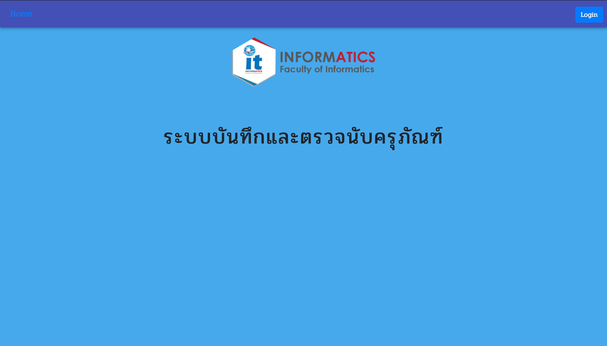

#AssetmentProject

This is my first project with MERN Stack 
it's have Reactjs for frontend, Expressjs for backend 
and database is mongodb 
in this project i use Redux to manage data between component and i use API for communicate to mobile application. 
 
and this is my project preview images 

This project have three main functions is add, delete and update with token authentication. 

and this project can export specific data to pdf

